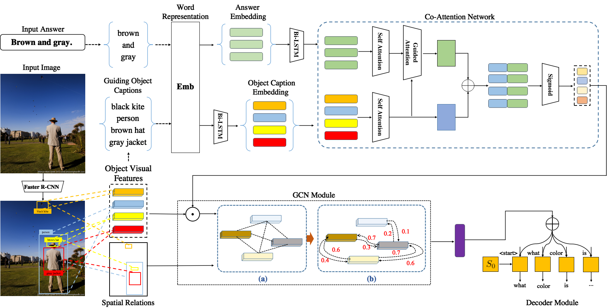

# MOAG

The **reproducing** code for ACM MM 2021 paper titled "Multiple Objects-Aware Visual Question Generation."  [[paper]](https://dl.acm.org/doi/abs/10.1145/3474085.3476969)


## Overview




## Installation

* PyTorch = 1.12


## Run MOAG

```shell
python train.py
```


## Reference

```shell
@inproceedings{10.1145/3474085.3476969,
author = {Xie, Jiayuan and Cai, Yi and Huang, Qingbao and Wang, Tao},
title = {Multiple Objects-Aware Visual Question Generation},
year = {2021},
booktitle = {Proceedings of the 29th ACM International Conference on Multimedia},
pages = {4546–4554},
}
```

